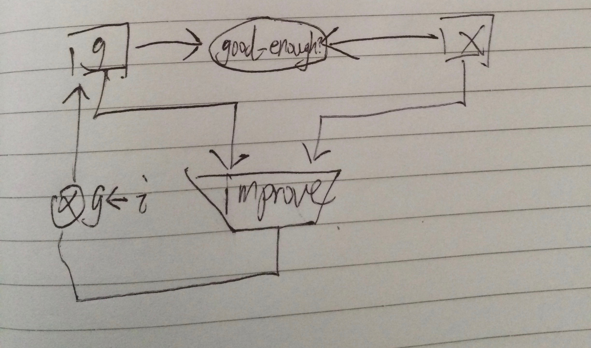
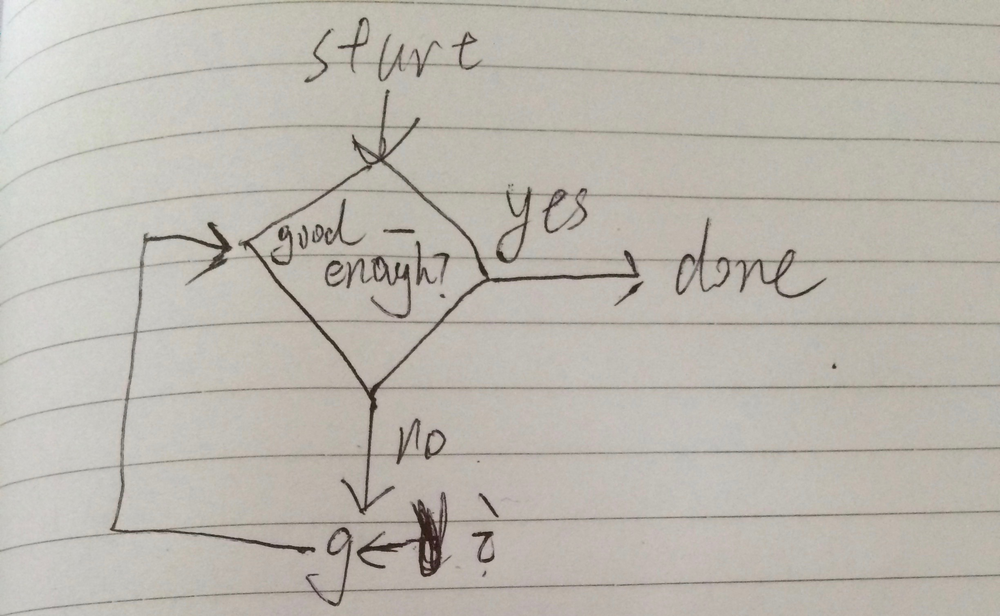

```scheme
; Exercise 5.2: Use the register-machine language to describe the iterative factorial machine of Exercise 5.1.
(load "/Users/soulomoon/git/SICP/Chapter5/ch5-regsim.scm")

(define (average x y) (/ (+ x y) 2))
(define (square x) (* x x))
(define (good-enough? guess x)
  (< (abs (- (square guess) x)) 0.001))
(define (improve guess x)
  (average guess (/ x guess)))
(define (print x)
  (newline )
  (display x)
  (newline ))
(define GCD-machine
(make-machine
  '(g x)
  (list (list 'good-enough? good-enough?) (list 'improve improve) (list 'print print))
  '(
    (assign g (const 1.0))
  test->
    (test (op good-enough?) (reg g) (reg x))
    (branch (label GCD-done))
    (assign g (op improve) (reg g) (reg x))
    (goto (label test->))
  GCD-done
    (perform (op print) (reg g))
)))

(define GCD-machine2
(make-machine
  '(g x t)
  (list
    (list '< <)
    (list '- -)
    (list 'abs abs)
    (list 'square square)
    (list 'improve improve)
    (list 'print print))
  '(
    (assign g (const 1.0))
  test->
    (assign t (op square) (reg g))
    (assign t (op -) (reg t) (reg x))
    (assign t (op abs) (reg t))
    (test (op <) (reg t) (const 0.001))
    (branch (label GCD-done))
    (assign g (op improve) (reg g) (reg x))
    (goto (label test->))
  GCD-done
    (perform (op print) (reg g))
)))

(define GCD-machine3
(make-machine
  '(g x t)
  (list
    (list '< <)
    (list '- -)
    (list '/ /)
    (list 'abs abs)
    (list 'square square)
    (list 'average average)
    (list 'improve improve)
    (list 'print print))
  '(
    (assign g (const 1.0))
  test->
    (assign t (op square) (reg g))
    (assign t (op -) (reg t) (reg x))
    (assign t (op abs) (reg t))
    (test (op <) (reg t) (const 0.001))
    (branch (label GCD-done))
    (assign t (op /) (reg x) (reg g))
    (assign g (op average) (reg g) (reg t))
    (goto (label test->))
  GCD-done
    (perform (op print) (reg g))
)))


(set-register-contents! GCD-machine 'x 2)
(start GCD-machine)
(set-register-contents! GCD-machine2 'x 2)
(start GCD-machine2)
(set-register-contents! GCD-machine3 'x 2)
(start GCD-machine3)

;Welcome to DrRacket, version 6.8 [3m].
;Language: SICP (PLaneT 1.18); memory limit: 128 MB.
;(REGISTER SIMULATOR LOADED)
;'done
;
;1.4142156862745097
;'done
;'done
;
;1.4142156862745097
;'done
;'done
;
;1.4142156862745097
;'done
;>
```
data-path:

controller:

